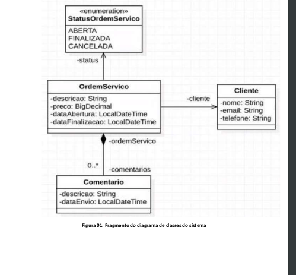

# Service Order API


Fatec Service Order API for [Fatec](https://www.fatecsaocaetano.edu.br/).

## Requirements


For building and running the application you need:

- [JDK 1.8](http://www.oracle.com/technetwork/java/javase/downloads/jdk8-downloads-2133151.html)
- [Maven 3](https://maven.apache.org)

## Running the application locally

There are several ways to run a Spring Boot application on your local machine. One way is to execute the `main` method in the `src/main/java/api/ServiceOrderApiApplication.java` class from your chosen IDE.

A workaround running is to using [Spring Boot Maven plugin](https://docs.spring.io/spring-boot/docs/current/reference/html/build-tool-plugins-maven-plugin.html) like so:

```shell

mvn spring-boot:run

```

Or else: 

```shell

mvn clean package

```
and:


```shell

 java -jar  target/ServiceOrderApi-0.0.1-SNAPSHOT.jar

```

